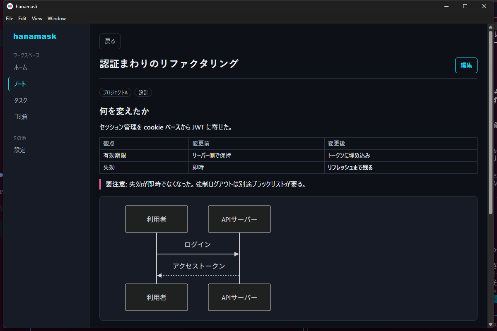
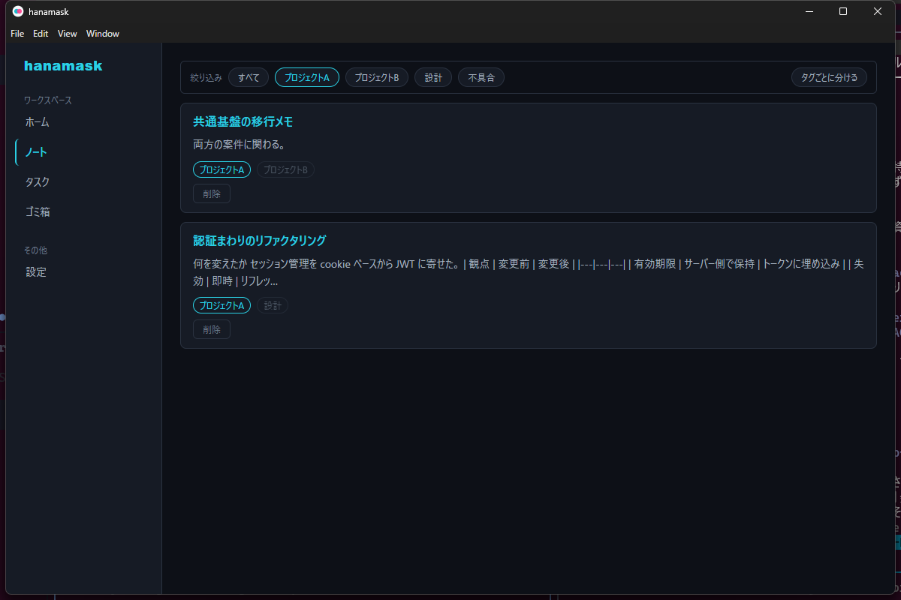

# hanamask

AI開発（AIエージェントとの協働）に最適化された、ローカル完結のノート・タスク管理デスクトップアプリ。

**MCPサーバーとして自身のツール群を公開し、利用者が普段使っているAIエージェント（Claude Code等のCLIエージェント）が直接ノート・タスクを読み書きする**ことを主要な操作経路とする。データはローカル（SQLite + ローカルファイル）に閉じ、クラウド同期を持たない。搭載予定のAIチャットも、hanamask自前のAIモデルではなく利用者自身が管理するAIエージェント（BYO Agent）を接続して使う設計とする。

詳細なコンセプト・機能要件は [docs/REQUIREMENTS.md](docs/REQUIREMENTS.md) を参照。利用者向けの紹介ページは **[公開サイト](https://tanar-tech.github.io/hanamask/)** にある。



**本文はエージェントが書き、人間が読む。**Markdown・HTMLの直接埋め込み・Mermaid図に対応する。本文は信頼できない入力として扱い、`<script>` や `<style>` は描画時に取り除く（[SECURITY.md](SECURITY.md)）。



**タグで案件ごとに分けられる。**エージェントが記録を増やし続けても、どのノート・タスクがどの案件のものかを一覧のまま判別できる。**選んだタグ以外は消さずに薄く残す**ので、「この記録は別の案件にも関わっている」ことが同時に分かる。

**タスクもノートと同じ本文とタグを持つ。**タイトルだけでは残せない経緯・受け入れ条件・参考リンクを、エージェントがそのまま書き込める。

## 使いはじめる

**必要なのは2つだけ。**Node.jsもソースコードも要らない（Electronアプリなので、実行に必要なものは同梱されている）。

### 1. hanamask を入れて起動する

[Releases](../../releases) から `hanamask-Setup-*.exe` をダウンロードして実行し、アプリを起動する。**起動したままにしておく**（つなぎ先はアプリの中で動いている）。

### 2. 利用しているAIエージェントに登録する（一度だけ）

Claude Code なら次の1行。**このあと何度も打つ必要はない。**

```bash
claude mcp add --scope user --transport http hanamask http://127.0.0.1:39217/mcp
```

`--scope user` を付けると、**どのフォルダで作業していても使える**（付けないとそのプロジェクトの中だけの登録になり、別のフォルダでまた登録することになる）。

他のエージェントを使っている場合は、設定ファイルに次を足す。

```json
{ "mcpServers": { "hanamask": { "type": "http", "url": "http://127.0.0.1:39217/mcp" } } }
```

**登録したらエージェントを立ち上げ直す。**エージェントは起動時に接続先を読むため、動いているセッションには反映されない。立ち上げ直したあと `create_page` や `create_task` が見えていれば準備完了。

> どちらのコマンドも、**hanamask の設定画面「AIエージェントから使う」からコピーできる。**ポートを変えている場合は、その値が入った状態で出る。

### 3. エージェントに書く習慣を持たせる（おすすめ）

**ツールが使える状態にしただけでは、エージェントは書きません。**頼まれたときだけ使い、普段は手近なファイルに書き続けます（**このアプリの開発中に実際に起きた**。MCPが繋がっているのに数日間まったく使われなかった）。

エージェントの設定に一節を置いておくと、頼まなくても書くようになります。Claude Code なら `~/.claude/CLAUDE.md` です。

> 貼り付ける文面は、**hanamask の設定画面「エージェントに書く習慣を持たせる」からコピーできる。**

要点は「作業の区切りと決定をその理由ごと書く」「**同じ話題は新規作成せず既存のページ・タスクを更新して育てる**」「**作業を始める前に検索して過去の経緯を引く**」の3つです。読む習慣が無ければ書いたものが次に効かず、更新しなければ同じ話題が何本にも散って、検索で引いても全部を読まないと経緯が分からなくなります。

**1つの案件のページが増えてきたら、エージェントがノート（束）にまとめます。**束の概要（何の案件か・どこまで進んだか）も、作業の区切りごとにエージェントが書き直すので、束を開かなくても案件の現在地が分かる状態が保たれます。アプリ側が勝手に推論して書くことはなく、更新は全てエージェントの操作として編集履歴に残ります。

**あとは普段どおり話しかけるだけ。**

```
今日調べたことをノートにまとめて
さっきのバグ、タスクに積んでおいて
このノートに「プロジェクトA」のタグを付けて
```

**エージェントが書いた内容は、開いている画面へ手動リロードなしで現れる。**

> **うまくつながらないときは。**hanamask が動いているかを確認する。**ウィンドウを閉じても通知領域に残って動き続ける**ので、閉じただけなら繋がる。通知領域のメニューから「終了」した場合と、まだ一度も起動していない場合は繋がらない。手で設定する場合の手順は[MCPサーバーへの接続](#mcpサーバーへの接続)にある。

### インストーラーの警告について

> **このインストーラーには署名を付けていない。**実行すると「WindowsによってPCが保護されました」という青い画面が出るので、**「詳細情報」→「実行」**と進める。署名しない判断の経緯と、配布範囲を広げる場合の選択肢は [docs/SIGNING.md](docs/SIGNING.md) にまとめてある。

データは `%APPDATA%\hanamask\` に保存され、アンインストールしても消えない。別のPCへ移すときは設定画面から書き出す。

#### 新しい版が出ていないか

**自動更新の仕組みはまだ無い。**[Releases](../../releases) を見て、いま入っているものより新しい版があれば、同じ手順で入れ直す。**上書きしてもデータは消えない。**

いま入っている版は、Windowsの「設定 → アプリ」の一覧か、インストール先（`%LOCALAPPDATA%\Programs\hanamask\`）の `hanamask.exe` のプロパティで確認できる。

不具合の修正が入っていることもあるので、[CHANGELOG.md](CHANGELOG.md) の「修正」に目を通してから判断するとよい。自動更新を入れられるかの調査は [docs/AUTO_UPDATE.md](docs/AUTO_UPDATE.md) にある。

## MCPサーバーへの接続


MCPサーバーはElectronのmainプロセスに内蔵されており、アプリ起動と同時に待ち受けを開始する。

- エンドポイント: `http://127.0.0.1:39217/mcp`（Streamable HTTPトランスポート）
- ポートの上書き: 環境変数 `HANAMASK_MCP_PORT`
- DBファイルパスの上書き: 環境変数 `HANAMASK_DB_PATH`（既定はElectronの `userData` ディレクトリ配下の `hanamask.sqlite3`）

### Claude Code からつなぐ

hanamask を起動した状態で、次を実行する。

```bash
claude mcp add --scope user --transport http hanamask http://127.0.0.1:39217/mcp
```

**`--scope user` を付けること。**付けないと、そのコマンドを実行したプロジェクトの中でしか使えない。

**登録したらエージェントを立ち上げ直す。**接続先は起動時に読まれるため、動いているセッションには反映されない。立ち上げ直したあと `claude mcp list` に `✔ Connected` と出れば繋がっている。あとは普段どおり話しかければよい。

```
「今日調べたことをノートにまとめて」
「さっきのバグ、タスクに積んでおいて」
```

**エージェントが書いた内容は、開いている画面へ手動リロードなしで現れる。**

自前のMCPクライアントからつなぐ場合は、SDKの `Client` + `StreamableHTTPClientTransport` で上記URLに接続する。

> **hanamask が動いていない間は繋がらない。**MCPサーバーはアプリの中で動いている。ただし**ウィンドウを閉じただけなら通知領域に残って動き続ける**ため、繋がったままになる。設定画面で「パソコンの起動時に hanamask を開始する」をオンにしておくと、起動を意識せずに使える（既定はオフ）。

## 画面構成


左側の列に、セクションタブ（ホーム／ノート／タスク／ゴミ箱／設定）と、ノート・無所属ページが混在する Explorer 型のツリー（タイトルの絞り込みボックスつき）。右側が内容という構成。ノートを選ぶと、ツリーの隣にそのノートのページ一覧ペインが開く。

**よく見る記録はピン留めできる。**ツリーの行か詳細画面のボタンでピン留めすると、ツリー最上部の「ピン留め」セクションに留めた順で並ぶ。ノートを開いたとき、中にピン留めページがあれば「最近更新されたページ」の代わりに「ピン留めしたページ」が出る。ピン留めは利用者の操作で、エージェント用の操作ツールは無い（エージェントには各ツールの返り値の `pinnedAt` として見えるだけ）。

| 画面 | 内容 |
|---|---|
| ホーム | 最近のノートと進行中のタスクを1画面で見渡す。起動時の既定画面 |
| ノート一覧 / ノート詳細 | 本文・タグの表示と編集、Mermaid図、画像添付、編集履歴、リンク |
| 設定 | AIチャットのAPIキーとモデル、データの書き出し・取り込み |
| タスク一覧 / カンバン / タスク詳細 | 本文・期限の表示と編集、リンク。3列（未着手・進行中・完了）のカンバンはドラッグ&ドロップで状態を変更できる |
| ゴミ箱 | 削除済みノートの一覧と復元。削除されるまでの残り日数を表示する |
| 検索結果 | タイトル・本文の部分一致検索 |

**MCP経由の操作は、開いている画面へ手動リロードなしで反映される。** エージェントが書き換えた直後のノートはピンクで示し、「たった今 · エージェントが更新」と文字でも表示する（色だけに意味を持たせない）。編集中に外から更新が来た場合は、編集内容を消さずに通知だけを出して利用者に選ばせる。新しく現れたノート・タスクは控えめな入場アニメーションで示す（OSの「視覚効果を減らす」設定を尊重する）。

**画面を見ていないときは、OSの通知で知らせる。** 通知するのはウィンドウにフォーカスが無いときだけ。UIで編集するにはフォーカスが要るので、自分の操作で鳴ることはない。短い間に続いた変更は1通にまとめ、クリックすると該当のノート・タスクを開く。

配色はライト／ダークの両テーマに対応し、OSの設定に追従する。

## タグで案件ごとに分ける

ノートとタスクは**タグ**を持つ。エージェントが記録を増やし続けると案件Aの話と案件Bの話が同じ一覧に混ざるので、タグで分けられるようにしてある。

- 一覧のカードにタグが出る。**どの記録がどの案件のものか、開かずに分かる**
- 一覧の上でタグを選ぶと絞り込める。複数選ぶと**どれかに一致**するものが残る
- 「タグごとに分ける」で、タグ別に並べ直せる。**複数のタグを持つ記録は、それぞれの見出しの下に出る**

**タグを付けるのはエージェント。**hanamask自身はAIを持たない（[docs/REQUIREMENTS.md](docs/REQUIREMENTS.md) §9）ので、繋がっているエージェントが `create_page` / `create_task` にタグを渡す。エージェントが同じ案件に別々の名前を付けてしまわないよう、**使われているタグを引く `list_tags`** を用意してある。

## ノート・タスク本文の書き方


ノートとタスクは**同じ本文**を持ち、同じ描画・同じサニタイズ方針で扱われる。本文は **Markdown** として描画される。見出し・箇条書き・コードブロック・引用に加え、GFMの記法（表・タスクリスト・取り消し線）も使える。

**HTMLを直接書くこともできる。** `<div style="...">` のように装飾を細かく指定したい場合はそのまま埋め込める。ただし本文はAIエージェントが書くため、`<script>` / `<iframe>` / `javascript:` リンク / `onerror` 等のイベントハンドラ属性は描画時に取り除かれる。**`style` 属性は使えるが、`<style>` タグは描画されない**（タグ内のCSSはアプリ全体に効いてしまうため）。詳しくは [SECURITY.md](SECURITY.md) を参照。

Mermaid図は ```` ```mermaid ```` のコードフェンスとして書く。

## データの書き出しと取り込み


設定画面から、ノート・タスク・リンク・編集履歴・画像を **zip1つ**に書き出せる。別のPCへ移す、OSを入れ直す、データが壊れたときの備え。

- **APIキーは書庫に含まれない**
- 取り込みは既存のデータを置き換える。**実行前の状態は自動でzipに退避され、その保存先が画面に表示される**（誤って実行しても戻せる）
- 画像はDBに絶対パスで記録されているため、取り込み時に新しい環境のパスへ貼り直される

## 実装済みのMCPツール


### ページ

| ツール | 内容 |
|---|---|
| `create_page` | ページを作成する（`title`, `body`, 任意の `tags`・`notebook_id`） |
| `get_page` | idで1件取得する（所属ノートの `notebookId` 付き。存在しなければ `null`） |
| `search_pages` | タイトル・本文の部分一致検索（空文字で全件。`notebook_id` で1つのノート内に絞れる） |
| `semantic_search_notes` | 意味の近いページ・ノート（束）・タスクを探す（言葉が一致しなくても内容が近ければ出る。ノート（束）は概要で近さを測る。モデルが準備できていなければ空の結果と理由を返す） |
| `update_page` | タイトル・本文・タグを更新する（省略した項目は据え置き） |
| `move_page` | ページをノートへ入れる・別のノートへ移す・`notebook_id: null` で無所属に戻す |
| `delete_page` | ソフトデリートする（`confirm: true` 必須） |
| `restore_page` | ソフトデリートしたページを復元する |
| `list_page_versions` | 編集履歴を新しい順に取得する |
| `restore_page_version` | 過去バージョンに戻す（戻す操作自体も履歴に積まれる） |
| `attach_image` | Base64の画像をページに添付する（png/jpeg/gif/webp、10MBまで） |

Mermaid図は専用ツールを持たず、ページ本文へのインライン記述として `update_page` で追加・更新する。

#### 互換名（`*_note`）

以前の名前も同じ処理を指す別名としてそのまま使える。引数・戻り値は上の表の対応するツールと同じ（`create_note` は `notebook_id` を、`search_notes` は絞り込みを説明文に載せていないだけで、渡せば同じように働く）。

| ツール | 内容 |
|---|---|
| `create_note` | `create_page` と同じ |
| `get_note` | `get_page` と同じ |
| `search_notes` | `search_pages` と同じ |
| `update_note` | `update_page` と同じ |
| `delete_note` | `delete_page` と同じ |
| `restore_note` | `restore_page` と同じ |
| `list_note_versions` | `list_page_versions` と同じ |
| `restore_note_version` | `restore_page_version` と同じ |

### ノート（束）

ノート（束）は、ページ（1件のノート）をまとめる入れ物。タグが横断的な目印なのに対し、束は「どこに置いてあるか」を表す。

| ツール | 内容 |
|---|---|
| `create_notebook` | ノート（束）を作成する（`title`, `summary`, 任意の `tags`） |
| `get_notebook` | idで1件取得する（所属ページの一覧付き。存在しない・ゴミ箱の中なら `null`） |
| `list_notebooks` | ノート（束）の一覧を取得する（ソフトデリート済みは除外） |
| `update_notebook` | タイトル・概要・タグを更新する（省略した項目は据え置き） |
| `delete_notebook` | ソフトデリートする（`confirm: true` 必須。所属ページは消えず、束に付いたまま残る） |
| `restore_notebook` | ソフトデリートしたノート（束）を復元する（所属ページごと戻る） |

`summary` は `semantic_search_notes` が束を探すときの手がかりになるので、束に何を集めているかを書いておく。

### タスク

| ツール | 内容 |
|---|---|
| `create_task` | タスクを作成する（`title`, 任意の `status`・`due_date`） |
| `update_task` | タイトル・ステータス・期限を更新する（`due_date: null` で期限クリア） |
| `list_tasks` | タスク一覧を取得する（ソフトデリート済みは除外） |
| `list_tags` | 使われているタグと、それぞれが付いたノート・タスクの件数を返す |
| `delete_task` | ソフトデリートする（`confirm: true` 必須） |
| `restore_task` | ソフトデリートしたタスクを復元する |

ステータスは `todo` / `in_progress` / `done`。

### リンク

| ツール | 内容 |
|---|---|
| `link_entities` | ノート/タスク/ノート（束、`notebook`）同士をリンクする（`from_type`, `from_id`, `to_type`, `to_id`） |
| `unlink_entities` | リンクをidで削除する（リンク先の実体は消さない） |
| `list_links` | あるエンティティに紐づくリンクを取得する（from/to どちら側も） |

### チャット

ページ・タスク・ノート（束）の詳細画面に付いているチャット欄を、エージェント側から読み書きする。

| ツール | 内容 |
|---|---|
| `wait_for_chat_message` | 利用者がチャット欄から送った発言を待ち受ける（`timeout_seconds` は既定30・最大45。時間切れは空の結果と `timed_out: true` で返り、エラーにはならない） |
| `reply_chat_message` | チャット欄に返信する（`entity_type`, `entity_id`, `body`。本文はMarkdownとして表示される） |
| `list_chat_messages` | ある対象の会話を古い順に取得する（`limit` は既定50・最大200で、新しい方から切る） |

未配信の発言は先に待ち受けた1体にだけ届く（同じ指示に複数のエージェントが答えるのを避けるため）。

### UI連携

| ツール | 内容 |
|---|---|
| `open_app` | アプリのウィンドウを前面に出す（閉じられていれば作り直す） |
| `open_note` | 指定したノートの詳細画面を開く |
| `open_notebook` | 指定したノート（束、`notebook`）の画面を開く |
| `open_task` | 指定したタスクの詳細画面を開く |
| `open_search` | 指定したクエリで検索結果画面を開く |

### 未実装

- AIチャットパネル（BYO Agent）は未実装（[docs/TASKS.md](docs/TASKS.md) T12）。

## 破壊的操作のガードレール


- 削除はすべてソフトデリート（`deleted_at` を立てる）で、物理削除は行わない。`delete_note` / `delete_task` は `confirm: true` を必須とする。
- ソフトデリートから30日を過ぎたレコードはアプリ起動時のパージで物理削除される。猶予日数は `TRASH_RETENTION_DAYS`（`src/shared/preload-api.ts`）が唯一の定義元で、パージ処理とゴミ箱の残り日数表示が同じ値を見る。
- ノートの更新前スナップショットは自動で履歴に保存され、`restore_note_version` で戻せる。

## 技術スタック


- **アプリ本体**: Electron（ネイティブデスクトップアプリ、ローカル動作）
- **UI（レンダラープロセス）**: React + Vite / Tailwind CSS v4（スタイリング）/ `motion`（アニメーション、LazyMotionで遅延ロード）/ Mermaid（図のレンダリング）
- **MCPサーバー**: `@modelcontextprotocol/sdk`（Node.js製）をmainプロセスに内蔵、localhost向けHTTPトランスポート（Streamable HTTP）で待ち受け
- **データ保存**: SQLite（`better-sqlite3`、メタデータ）+ ローカルファイルシステム（画像）
- **テスト**: Vitest（単体・レンダラー）+ Playwrightの `_electron` API（E2E）

## ドキュメント


- [docs/REQUIREMENTS.md](docs/REQUIREMENTS.md): 機能要件・非機能要件・データモデル・MCPツール一覧
- [docs/TASKS.md](docs/TASKS.md): 実装タスクの分解・依存関係・進捗
- [docs/TESTING.md](docs/TESTING.md): テストケース作成方針
- [docs/MIGRATIONS.md](docs/MIGRATIONS.md): DBスキーマ変更の規約（既存利用者のDBを壊さないための手順）
- [docs/PACKAGING.md](docs/PACKAGING.md): Windowsインストーラーのビルド手順
- [docs/SIGNING.md](docs/SIGNING.md): インストーラーの署名に必要なものと手順
- [docs/WSL.md](docs/WSL.md): WSLのAIエージェントからWindowsアプリのMCPへ接続する設定
- [docs/GOVERNANCE.md](docs/GOVERNANCE.md): 体制・運用ルール
- [docs/HERDR.md](docs/HERDR.md) / [docs/CODEX.md](docs/CODEX.md): 並列開発（herdr・Codex CLI）のセットアップ
- [docs/HUNK.md](docs/HUNK.md): hunk による差分レビュー（導入・エージェント連携）
- [docs/safety.md](docs/safety.md): 自律ループに許可する範囲
- [CLAUDE.md](CLAUDE.md): 開発時のセッション指示
- `site/`: 公開サイト（GitHub Pages）のソース。`npm run build:site` で `dist-site/` に出力し、`main` の `site/**` が変わると `.github/workflows/pages.yml` が配信する
